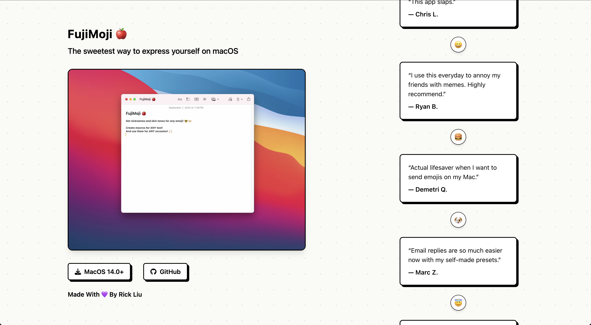

# 🍎 FujiMoji Website



## 🚀 Quick Start

### Prerequisites

- Node.js 16+ 
- npm or yarn

### Installation

```bash
# Clone the repository
git clone https://github.com/RickLiu1203/FujiMoji-site.git
cd FujiMoji-site

# Install dependencies
npm install

# Start development server
npm run dev
```

The site will be available at `http://localhost:5173`

## 🛠️ Built With

- **[React](https://reactjs.org/)** - UI framework
- **[TypeScript](https://www.typescriptlang.org/)** - Type safety
- **[Vite](https://vitejs.dev/)** - Build tool and dev server
- **[Tailwind CSS](https://tailwindcss.com/)** - Styling
- **[React Icons](https://react-icons.github.io/react-icons/)** - Icon components

## 📝 Available Scripts

```bash
# Development
npm run dev          # Start development server
npm run build        # Build for production
npm run preview      # Preview production build
npm run lint         # Run ESLint
```

## 📱 Download FujiMoji

- **[Download for macOS](https://github.com/RickLiu1203/FujiMoji/releases/download/v1.0/FujiMoji.dmg)** - Latest release (v1.0)
- **[GitHub Repository](https://github.com/RickLiu1203/FujiMoji)** - Source code and issues

## 📄 License

This project is licensed under the MIT License.

## 👨‍💻 Author


**[@RickLiu1203](https://github.com/RickLiu1203)**

---

<div align="center">
  <p>Made with 💜 by Rick Liu</p>
</div>